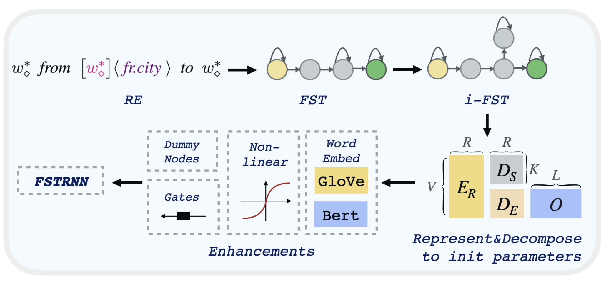

# RE2NN-SEQ
Source code for our EMNLP2021 paper: "[Neuraling Regular Expressions for Slot Filling](http://faculty.sist.shanghaitech.edu.cn/faculty/tukw/emnlp21.pdf)".

As the title we turn RE for slot filling into a trainable neural network.



### Prepare environment
```cd src_seq && pip install -r requirements.txt```

### Download data/rule/transducer files
Please download the data files (data.zip) first using one of these links 
[google drive](https://drive.google.com/file/d/17st9VrnhNem-1xPLcp4IHGK_xifl5N9i/view?usp=sharing), [tencent drive](https://share.weiyun.com/qds6EG2C).
Then extract it under the **/data** folder.
```
unzip data.zip
```
Your directory structure should be like:
```
/RE2NN-SEQ
    /data
        /ATIS-BIO
        /ATIS-ZH-BIO
        /SNIPS-BIO
    /src_seq
    /model_seq
    ...
```
We provide the
- raw dataset files
- preprocessed dataset files
- embedding files (e.g. glove.300.emb)
- rule files (e.g. bio.rules.config)
- created and decomposed transducer files (e.g. /ATIS-BIO/automata/xxx.pkl)

### Run the code
Make sure you download the data files.
model_seq contains example configs, you can directly run the code using the hyper-parameters in the configs and get the results using
```
python main.py --args_path ../model_seq/config_file_path.res
```

key parameters
- dataset (ATIS/ATIS-ZH/SNIPS)
- automata_path
- farnn (0/2)
- use_crf (0/1)
- method (decompose/onehot)
- use_bert (0/1)
- bert_finetune (0/1)


### Guidelines on using your own data and rules
### dataset
To preprocess your dataset and create vocab files,
you need to modify function ```create_slot_dataset``` in ```data.py```, and run it.

### rules for slot filling
Our rules for slot filling is **regular expressions with capturing groups**.
You can refer to the provided rule files ```data/xxx-BIO/rules.bio.config```, they will help yo write your own rules.

The basic syntax is ```Sub-expression<:>Label```, we aims to tag the content matched by sub-expressions as the provided label

The syntax symbol is a little bit different, ```$``` is wildcard word, ```OO``` is wildcard label.
We also support some handy shortcuts, for example, we allow defining a sub-expression variable, and support comments
For example: 
```
// class_type
@class_type@=(first class | coach class | coach | thrift)
$<:>OO * @class_type<:>class_type@ $<:>OO *
```
This RE will tag `first class, coach class` as `B-class_type I-class_type`
and `coach, thrift` as `B-class_type`, no matter what former and latter contexts are. 

You can check your rule's sanity by
```
cd src_seq/rule_utils
python rule_pre_parser.py --rule_path ../../data/ATIS-BIO/bio.rules.config
```
and check the parsed rule files, if some rules are missed, they may have syntax problems.

### transducer
You can check the rule performance by first create transducer:
(transducer can be viewed as a automata whose input vocabulary is the catesian product of the transducer's input vocabulary and output vocabulary)
```
cd src_seq/wfa
python create_dataset_automata.py --independent 2 --decompose 0 \
--rule_name bio.rules.config --dataset SNIPS-BIO --k_best 1 \
--automata_name my_rule
```
- FST:  --independent 0 
- i-FST: --independent 2

You will get automata files, `my_rule.ID2` in `data/SNIPS-BIO/automata`, and a graph drawing the transducer

and then run the automata/rules
```
cd src_seq
python main.py --dataset SNIPS-BIO --method onehot \
--automata_path ../data/SNIPS-BIO/automata/my_rule.ID2 \
--normalize_automata none --rand_constant 0
```

To decompose the transducer
```
cd src_seq/wfa
python create_dataset_automata.py --independent 2 --decompose 1 \
--rule_name bio.rules.config --dataset SNIPS-BIO --k_best 3 \
--automata_name my_rule_decomposed
```

Run and train the decomposed transducer
```
cd src_seq/
python main.py --independent 2 --dataset SNIPS-BIO --method decompose \
--automata_path your_decomposed_automata.pkl --train_portion 1 --beta 0.1 \
--update_nonlinear tanh --lr 0.001
```
